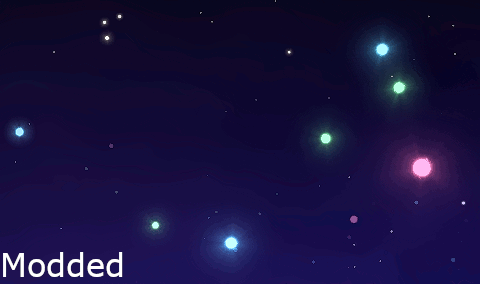
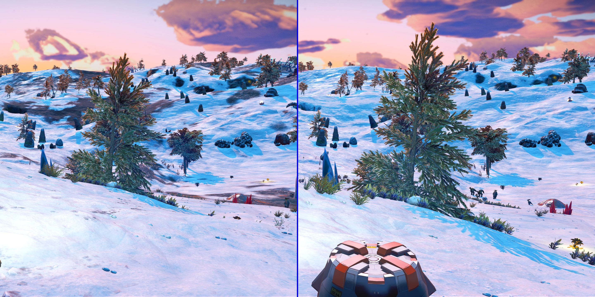

# NoMansSkyLuaMods

To do list:

* Improve bird flock formation
* Add resource rich planets: a small chance that a planet will have one of the typical harvestables for that biome but with much greater coverage.

## Better Star Colors

## Less Patchy Snow

## No Hazard Screen Refraction

